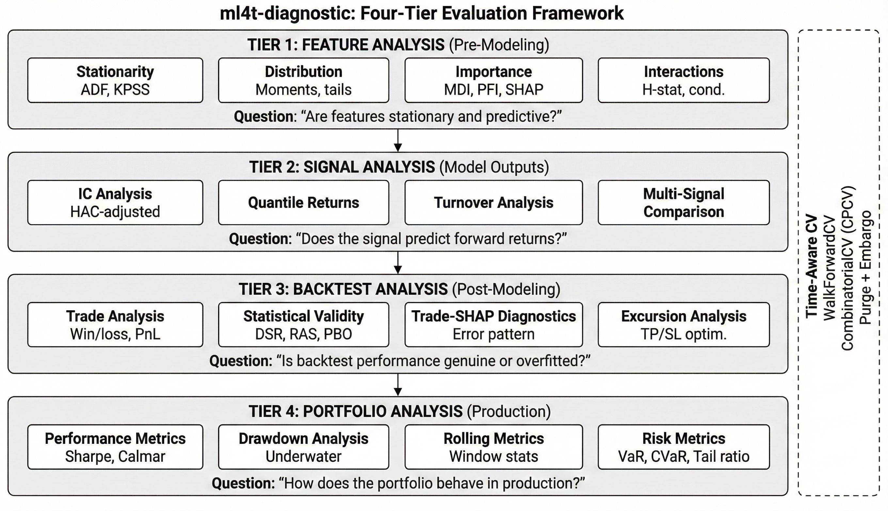

# ml4t-diagnostic

[](https://www.python.org/downloads/)
[](https://pypi.org/project/ml4t-diagnostic/)
[](https://opensource.org/licenses/MIT)

Statistical validation and diagnostics for quantitative trading strategies: signal analysis, backtest evaluation, and overfitting detection.

## Part of the ML4T Library Ecosystem

This library is one of five interconnected libraries supporting the machine learning for trading workflow described in [Machine Learning for Trading](https://mlfortrading.io):


Each library addresses a distinct stage: data infrastructure, feature engineering, signal evaluation, strategy backtesting, and live deployment.

## What This Library Does

Evaluating whether a signal or strategy has genuine predictive power requires statistical rigor. ml4t-diagnostic provides:

- Information coefficient (IC) analysis with HAC-adjusted standard errors
- Deflated Sharpe Ratio (DSR) and other multiple-testing corrections
- Combinatorial purged cross-validation (CPCV) for time series
- Feature importance analysis (MDI, PFI, MDA, SHAP)
- Trade-level diagnostics with SHAP-based error pattern discovery
- Portfolio performance metrics and tear sheets

The library implements methods from the academic finance literature, particularly those addressing backtest overfitting and false discovery in strategy research.



## Installation

```bash
pip install ml4t-diagnostic
```

Optional dependencies:

```bash
pip install ml4t-diagnostic[ml]   # SHAP, importance analysis
pip install ml4t-diagnostic[viz]  # Plotly visualizations
pip install ml4t-diagnostic[all]  # Everything
```

## Quick Start

### Signal Analysis

```python
from ml4t.diagnostic.evaluation import SignalAnalysis

analyzer = SignalAnalysis(
    signal=factor_data,
    returns=forward_returns,
    periods=[1, 5, 21],
)

# IC with HAC adjustment for autocorrelation
ic_result = analyzer.compute_ic_analysis()
print(f"IC: {ic_result.ic_mean:.4f}, HAC t-stat: {ic_result.hac_tstat:.2f}")

# Quantile returns
quantile_result = analyzer.compute_quantile_analysis()
print(f"Q5-Q1 spread: {quantile_result.spread:.2%}")
```

### Deflated Sharpe Ratio

```python
from ml4t.diagnostic.evaluation import stats

# Accounts for multiple testing
dsr_result = stats.compute_dsr(
    returns=strategy_returns,
    benchmark_sr=0.0,
    n_trials=100,
)

print(f"Sharpe: {dsr_result['sr']:.2f}")
print(f"Deflated Sharpe: {dsr_result['dsr']:.2f}")
print(f"Significant: {dsr_result['is_significant']}")
```

### Feature Importance

```python
from ml4t.diagnostic.evaluation import analyze_ml_importance

# Combines MDI, PFI, MDA, SHAP methods
results = analyze_ml_importance(model, X, y)
print(results.consensus_ranking)
```

### Trade Diagnostics

```python
from ml4t.diagnostic.evaluation import TradeAnalysis, TradeShapAnalyzer

analyzer = TradeAnalysis(trade_records)
worst_trades = analyzer.worst_trades(n=20)

# SHAP-based error pattern discovery
shap_analyzer = TradeShapAnalyzer(model, features_df, shap_values)
result = shap_analyzer.explain_worst_trades(worst_trades)

for pattern in result.error_patterns:
    print(f"Pattern: {pattern.hypothesis}")
    print(f"Potential savings: ${pattern.potential_impact:,.2f}")
```

## Diagnostic Framework

```
Tier 1: Feature Analysis (Pre-Modeling)
├── Time series diagnostics (stationarity, ACF, volatility)
├── Distribution analysis (moments, normality, tails)
├── Feature importance (MDI, PFI, MDA, SHAP)
└── Feature interactions (conditional IC, H-stat)

Tier 2: Signal Analysis (Model Outputs)
├── IC analysis (time series, histogram, decay)
├── Quantile returns (spreads, monotonicity)
├── Turnover analysis
└── Multi-signal comparison

Tier 3: Backtest Analysis (Post-Modeling)
├── Trade analysis (win/loss, holding periods)
├── Statistical validity (DSR, RAS, PBO)
├── Trade-SHAP diagnostics
└── Excursion analysis (TP/SL optimization)

Tier 4: Portfolio Analysis (Production)
├── Performance metrics (Sharpe, Sortino, Calmar)
├── Drawdown analysis
├── Rolling metrics
└── Risk metrics (VaR, CVaR)
```

## Statistical Methods

| Method | Purpose |
|--------|---------|
| DSR (Deflated Sharpe) | Corrects for multiple testing bias |
| CPCV (Combinatorial Purged CV) | Leak-free time series validation |
| RAS (Rademacher Anti-Serum) | Backtest overfitting detection |
| PBO | Probability of backtest overfitting |
| HAC-adjusted IC | Autocorrelation-robust information coefficient |
| FDR Control | Multiple comparisons (Benjamini-Hochberg) |

## Cross-Validation

```python
from ml4t.diagnostic.splitters import WalkForwardCV, CombinatorialCV
from ml4t.diagnostic.visualization import plot_cv_folds

# Walk-forward with purging
cv = WalkForwardCV(n_splits=5, train_size=252, test_size=63, purge_days=21)

# Visualize fold structure
fig = plot_cv_folds(cv, dates)
fig.show()
```

## Technical Characteristics

- **Polars-based**: Native Polars DataFrames throughout
- **HAC standard errors**: Newey-West adjustment for autocorrelated data
- **Time-aware validation**: Purged and embargoed cross-validation splits

## Related Libraries

- **ml4t-data**: Market data acquisition and storage
- **ml4t-engineer**: Feature engineering and technical indicators
- **ml4t-backtest**: Event-driven backtesting
- **ml4t-live**: Live trading with broker integration

## Development

```bash
git clone https://github.com/applied-ai/ml4t-diagnostic.git
cd ml4t-diagnostic
uv sync
uv run pytest tests/ -q -n auto
uv run ty check
```

## References

- Lopez de Prado, M. (2018). *Advances in Financial Machine Learning*. Wiley.
- Bailey, D., & Lopez de Prado, M. (2012). "The Sharpe Ratio Efficient Frontier."
- Bailey, D., et al. (2014). "The Deflated Sharpe Ratio."

## License

MIT License - see [LICENSE](LICENSE) for details.
