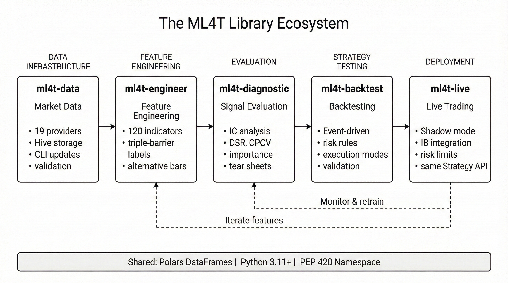
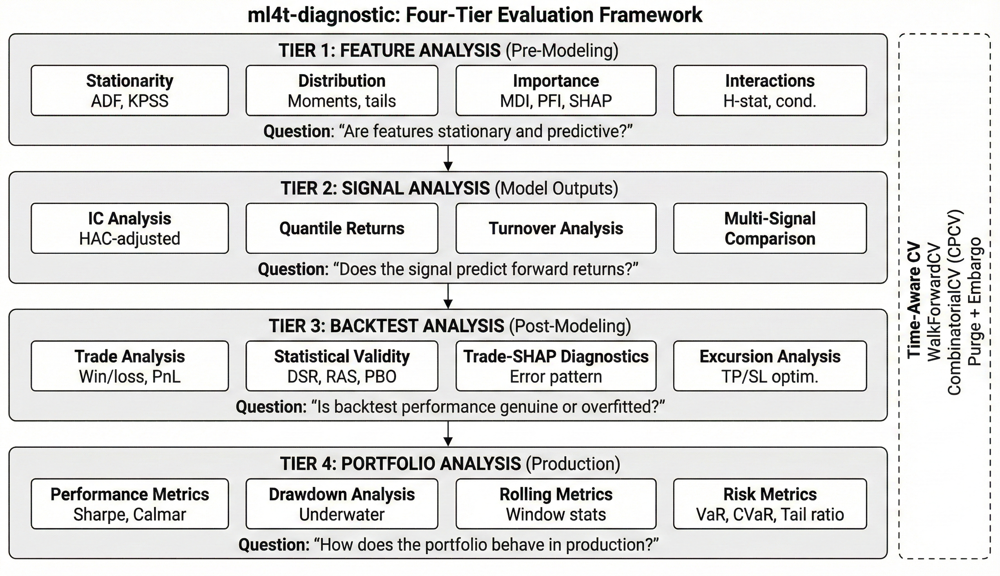

# ml4t-diagnostic

[](https://www.python.org/downloads/)
[](https://pypi.org/project/ml4t-diagnostic/)
[](https://opensource.org/licenses/MIT)

Statistical validation and diagnostics for quantitative trading strategies: signal analysis, backtest evaluation, and overfitting detection.

Documentation: https://ml4trading.io/docs/diagnostic/

## Part of the ML4T Library Ecosystem

This library is one of five interconnected libraries supporting the machine learning for trading workflow described in [Machine Learning for Trading](https://mlfortrading.io):



Each library addresses a distinct stage: data infrastructure, feature engineering, signal evaluation, strategy backtesting, and live deployment.

## What This Library Does

Evaluating whether a signal or strategy has genuine predictive power requires statistical rigor. ml4t-diagnostic provides:

- Information coefficient (IC) analysis with HAC-adjusted standard errors
- Deflated Sharpe Ratio (DSR) and other multiple-testing corrections (RAS, PBO, FDR)
- Combinatorial purged cross-validation (CPCV) with calendar-aware splitting
- Feature importance analysis (MDI, PFI, MDA, SHAP) with consensus ranking
- Trade-level diagnostics with SHAP-based error pattern discovery
- Backtest reporting: `BacktestProfile`, report metadata, and template-based HTML tearsheets
- Portfolio analysis: 16 performance metrics (Sharpe, Sortino, Calmar, VaR, CVaR, ...)
- Systematic feature selection with IC, importance, correlation, and drift filtering
- 65+ Plotly visualizations with 4 themes (default, dark, print, presentation)

The library implements methods from the academic finance literature, particularly those addressing backtest overfitting and false discovery in strategy research.



## Installation

```bash
pip install ml4t-diagnostic
```

Optional dependencies:

```bash
pip install ml4t-diagnostic[ml]   # SHAP, importance analysis
pip install ml4t-diagnostic[viz]  # Plotly visualizations
pip install ml4t-diagnostic[backtest]  # ml4t-backtest bridge
pip install ml4t-diagnostic[dashboard]  # Streamlit dashboard
pip install ml4t-diagnostic[all]  # Everything
```

## Quick Start

### Signal Analysis

```python
from ml4t.diagnostic import analyze_signal

result = analyze_signal(
    factor=factor_data,  # date, asset, factor
    prices=price_data,   # date, asset, price
    periods=(1, 5, 21),
)

print(f"IC (1D): {result.ic['1D']:.4f}")
print(f"IC t-stat (1D): {result.ic_t_stat['1D']:.2f}")
print(f"Q5-Q1 spread (1D): {result.spread['1D']:.2%}")
```

### Backtest Tear Sheet

```python
from ml4t.diagnostic.visualization.backtest import generate_backtest_tearsheet

html = generate_backtest_tearsheet(
    trades=trades_df,
    returns=daily_returns,
    metrics={"sharpe": 1.5, "max_drawdown": -0.15},
    template="hedge_fund",    # or "quant_trader", "risk_manager", "full"
    theme="default",          # or "dark", "print", "presentation"
    output_path="report.html",
    n_trials=100,             # for DSR multiple-testing correction
)
```

### Backtest Reporting From `ml4t-backtest`

```python
from ml4t.diagnostic.integration import (
    BacktestReportMetadata,
    generate_tearsheet_from_result,
)

html = generate_tearsheet_from_result(
    result=backtest_result,
    template="risk_manager",
    report_metadata=BacktestReportMetadata(
        strategy_name="ETF Momentum",
        benchmark_name="SPY",
        evaluation_window="2018-01-01 to 2025-12-31",
    ),
    output_path="backtest_result_report.html",
)
```

### Deflated Sharpe Ratio

```python
from ml4t.diagnostic.evaluation.stats import deflated_sharpe_ratio

# Accounts for multiple testing
dsr_result = deflated_sharpe_ratio(
    returns=strategy_returns,
    benchmark_sharpe=0.0,
    n_trials=100,
)

print(f"Sharpe: {dsr_result.sharpe_ratio:.2f}")
print(f"Deflated Sharpe: {dsr_result.deflated_sharpe:.2f}")
print(f"Significant: {dsr_result.is_significant}")
```

## Diagnostic Framework

```
Tier 1: Feature Analysis (Pre-Modeling)
├── Time series diagnostics (stationarity, ACF, volatility)
├── Distribution analysis (moments, normality, tails)
├── Feature importance (MDI, PFI, MDA, SHAP)
└── Feature interactions (conditional IC, H-stat)

Tier 2: Signal Analysis (Model Outputs)
├── IC analysis (time series, histogram, decay)
├── Quantile returns (spreads, monotonicity)
├── Turnover analysis
└── Multi-signal comparison

Tier 3: Backtest Analysis (Post-Modeling)
├── Trade analysis (win/loss, holding periods)
├── Statistical validity (DSR, RAS, PBO)
├── Trade-SHAP diagnostics
└── Excursion analysis (TP/SL optimization)

Tier 4: Portfolio Analysis (Production)
├── Performance metrics (Sharpe, Sortino, Calmar)
├── Drawdown analysis
├── Rolling metrics
└── Risk metrics (VaR, CVaR)
```

## Statistical Methods

| Method | Purpose |
|--------|---------|
| DSR (Deflated Sharpe) | Corrects for multiple testing bias |
| CPCV (Combinatorial Purged CV) | Leak-free time series validation |
| RAS (Rademacher Anti-Serum) | Backtest overfitting detection |
| PBO | Probability of backtest overfitting |
| HAC-adjusted IC | Autocorrelation-robust information coefficient |
| FDR Control | Multiple comparisons (Benjamini-Hochberg) |

## Cross-Validation

Calendar-aware splitting with trading-day gaps:

```python
from ml4t.diagnostic.splitters import WalkForwardCV, CombinatorialCV
from ml4t.diagnostic.visualization import plot_cv_folds

# Walk-forward with purging (gaps in trading days, not calendar days)
cv = WalkForwardCV(n_splits=5, train_size=252, test_size=63, purge_days=21)

# Combinatorial purged CV (de Prado)
cpcv = CombinatorialCV(n_groups=6, n_test_groups=2, purge_days=5)

# Calendar-aware: "4W" = 20 trading sessions, not 28 calendar days
cv = WalkForwardCV(n_splits=5, train_size="52W", test_size="4W", calendar="NYSE")

# Visualize fold structure
fig = plot_cv_folds(cv, dates)
fig.show()
```

## Backtest Tear Sheets

The tearsheet pipeline supports direct rendering from normalized surfaces,
`BacktestResult`, or saved run artifacts.

Four presets covering different analysis needs:

| Template | Focus | Sections |
|----------|-------|----------|
| `quant_trader` | Trade-level analysis | overview, trading, performance, validation, ML, factors |
| `hedge_fund` | Performance and costs | overview, performance, trading, validation, factors, ML |
| `risk_manager` | Statistical credibility | overview, validation, performance, trading, factors, ML |
| `full` | Comprehensive presentation | overview, performance, trading, validation, factors, ML |

Object-oriented API for custom tearsheets:

```python
from ml4t.diagnostic.visualization.backtest import BacktestTearsheet
from ml4t.diagnostic.integration import BacktestReportMetadata

tearsheet = BacktestTearsheet(template="quant_trader", theme="dark")
tearsheet.add_profile(profile)
tearsheet.add_report_metadata(
    BacktestReportMetadata(strategy_name="ETF Momentum", benchmark_name="SPY")
)
tearsheet.enable_section("shap_errors")
html = tearsheet.generate(output_path="report.html")
```

## Portfolio Analysis

```python
from ml4t.diagnostic.evaluation import PortfolioAnalysis

pa = PortfolioAnalysis(daily_returns)
metrics = pa.compute_metrics()

print(f"Sharpe: {metrics.sharpe_ratio:.2f}")
print(f"Sortino: {metrics.sortino_ratio:.2f}")
print(f"Max Drawdown: {metrics.max_drawdown:.2%}")
print(f"VaR (95%): {metrics.value_at_risk:.2%}")
```

Available metrics: `sharpe_ratio`, `sortino_ratio`, `calmar_ratio`, `omega_ratio`, `tail_ratio`, `max_drawdown`, `annual_return`, `annual_volatility`, `value_at_risk`, `conditional_var`, `stability_of_timeseries`, `alpha_beta`, `information_ratio`, `up_down_capture`, and more.

## Feature Selection

Systematic multi-criteria feature filtering:

```python
from ml4t.diagnostic import FeatureSelector

selector = FeatureSelector()
report = selector.run_pipeline(
    ic_results=ic_results,
    importance_results=importance_results,
    correlation_matrix=corr_matrix,
)

selected = selector.get_selected_features()
print(f"Selected {len(selected)} features from {report.initial_count}")
```

Steps: IC filtering, importance filtering, correlation filtering, drift filtering.

## Feature Importance

```python
from ml4t.diagnostic.metrics import analyze_ml_importance

# Combines MDI, PFI, MDA, SHAP methods
results = analyze_ml_importance(model, X, y)
print(results.consensus_ranking)
```

## Trade Diagnostics

```python
from ml4t.diagnostic.evaluation import TradeAnalysis, TradeShapAnalyzer

analyzer = TradeAnalysis(trade_records)
worst_trades = analyzer.worst_trades(n=20)

# SHAP-based error pattern discovery
shap_analyzer = TradeShapAnalyzer(model, features_df, shap_values)
result = shap_analyzer.explain_worst_trades(worst_trades)

for pattern in result.error_patterns:
    print(f"Pattern: {pattern.hypothesis}")
    print(f"Potential savings: ${pattern.potential_impact:,.2f}")
```

Fold-aware SHAP for walk-forward CV models:

```python
from ml4t.diagnostic.evaluation.trade_shap import compute_fold_shap

# Compute SHAP values across walk-forward folds
aligned_features, shap_values = compute_fold_shap(
    boosters=fold_models,        # {fold_id: booster}
    predictions_df=predictions,
    features_df=features,
    feature_names=feature_names,
)
```

## Documentation

- [Docs Site](https://ml4trading.io/docs/diagnostic/) — deployed documentation
- [Backtest Tearsheets](docs/user-guide/backtest-tearsheets.md) — `BacktestResult`, artifact, and profile-driven reporting
- [Book Guide](docs/book-guide/index.md) — chapter and case-study map
- [Workflows](docs/user-guide/workflows.md) — end-to-end analysis patterns
- [Validation Tiers](docs/user-guide/validation-tiers.md) — four-tier diagnostic framework
- [Cross-Validation](docs/user-guide/cross-validation.md) — CPCV and walk-forward splitting
- [CV Configuration](docs/user-guide/cv-configuration.md) — JSON/YAML config and fold persistence
- [Feature Diagnostics](docs/user-guide/feature-diagnostics.md) — importance and interaction analysis
- [Feature Selection](docs/user-guide/feature-selection.md) — systematic multi-criteria selection
- [Statistical Tests](docs/user-guide/statistical-tests.md) — DSR, RAS, PBO, HAC
- [Trade Analysis](docs/user-guide/trade-analysis.md) — trade-level diagnostics and SHAP

## Technical Characteristics

- **Polars-based**: Native Polars DataFrames throughout
- **HAC standard errors**: Newey-West adjustment for autocorrelated data
- **Time-aware validation**: Purged and embargoed cross-validation splits
- **Calendar-aware**: NYSE, CME, crypto calendars for trading-day gaps
- **65+ visualizations**: Plotly-based with 4 themes (default, dark, print, presentation)
- **PDF/HTML export**: Institutional-grade tear sheets
- **Type-safe**: 0 type diagnostics (ty/Astral), full type annotations
- **4,978 tests**: Comprehensive test coverage

## Related Libraries

- **ml4t-data**: Market data acquisition and storage
- **ml4t-engineer**: Feature engineering and technical indicators
- **ml4t-backtest**: Event-driven backtesting
- **ml4t-live**: Live trading with broker integration

## Development

```bash
git clone https://github.com/ml4t/diagnostic.git
cd ml4t-diagnostic
uv sync
uv run pytest tests/ -q -n auto
uv run ty check
```

## References

- Lopez de Prado, M. (2018). *Advances in Financial Machine Learning*. Wiley.
- Bailey, D., & Lopez de Prado, M. (2012). "The Sharpe Ratio Efficient Frontier."
- Bailey, D., et al. (2014). "The Deflated Sharpe Ratio."
- Bailey, D., et al. (2016). "The Probability of Backtest Overfitting."
- Lopez de Prado, M. (2020). "Combinatorial Purged Cross-Validation."

## License

MIT License - see [LICENSE](LICENSE) for details.
